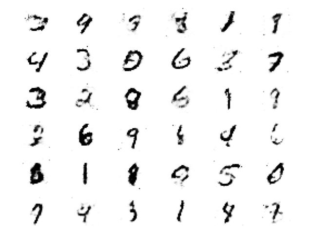

# Generate Handwritting MNIST Number with Basic GAN

Super basic GAN pipeline to generate Handwritting MNIST Number



## Environments

- Python 3.10.6

Install environments with

``` bash
bash scripts/setup_environments
```

## Data

You can download MNIST dataset from [here](https://drive.google.com/file/d/1JimUxm4tpbsg2zOqbGnbJDzJHwgp6by7/view?usp=share_link) or use torch dataset

## Checkpoint

You can download pretrained weight from [here](https://drive.google.com/file/d/1eeG9hb1GtF7BDjkyfj76oSz5TnEPWwNc/view?usp=share_link), train with default config. But I recommend you to retrain from scratch

## Train

You can modify config in `cfg/cfg.yaml` and run

``` bash
python tools/train.py
```

## Infer

After training, you get weight for model in `training_runs/exp...`, set weight in `best_checkpoint` of config and run

``` bash
python tools/infer.py
```

## Reference

- MNIST dataset in `.png`: [myleott/mnist_png](https://github.com/myleott/mnist_png)